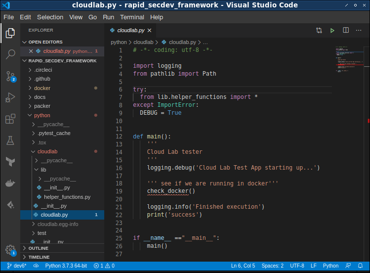

.. include:: global.rst

=====================
DevSecOps Quick Start
=====================

.. image:: ../images/sky-690293_1920.jpg
   :align: center

|

The term DevSecOps is an amalgam of the words development, security and operations. Simply put,
DevSecOps lives at the intersection of application development, information security, and 
network operations. As we will soon discover, Infrastructure as Code (IaC) is the platform upon 
which software flows moves through continuous delivery cycle. To the extent possible, we attempt
to realize gains in performance of our people and projects by leveraging automation and Agile
development practices.

.. index::
   single: devsecops
   single: Infrastructure as Code (IaC)

The world is changing with respect to how how software is created and maintained. Folks
at the leading edge in today's computing industry are not just building software, but
are curating it through a cyclical process of continuous development, testing, use, and
improvement. With increasing frequency, applications and workloads are moving to 
computing environments that are abstracted away, managed by invisible armies of engineers
at companies other than their own. Of course we are referring to those multitenant cloud
type computing landscapes. Passing one or more fully encapsulated applications to a cloud 
provider for the purposes of having them host it as a production environment has become
commonplace. Further, cloud service providers are adding new features and capabilities at
breakneck speed. 

At the time of this writing in 2020, about 40% of production workloads are 
running on containers and serverless deployments.  Bare metal and virtual machines currently host 
a bit over 60% of production workloads. Containerized workload use is expected to 
increase even more in the coming years. Conversely, bare metal and VM usage is expected 
to decrease [#]_ . It's not a question of if, but how quickly commoditization of 
compute resources takes place, perhaps leaving only a few main providers of these cloud resources.
This is not unlike how power generation and distribution became centralized in the previous century, now
the domain of a few large utility companies. Nothing beyond considerations of time, money, and
practicality stop you from making your own electricity, but most folks are keen to invest their 
efforts in other pursuits.

.. [#] https://start.paloaltonetworks.com/esg-research-cloud-native-devsecops-report.html 

In this book, we will explore a combination of techniques that can refresh
your skills and align your projects with the technological leading edge. 
We will introduce various popular technologies, then use common bits and pieces of these to create a secure build 
pipeline for our lab and development work, test, and even production environments. 
The techniques here are meant to help the security-minded developer sharpen her or his
skills, and introduce tips and tactics that benefit the teams they are a part of.
There are many, many ways to reach similar goals these days with the preponderance
of Open Source and commercial tools that are available. By focusing on a few we can blaze a
trail to success in our projects.

We have a goal in mind of selecting complementary tools and process to construct 
and streamline our ways of working. We will attempt to leverage these ways to 
get us quickly and securely to a working lab environment. At the same time we 
should strive for simplicity and reduction of complexity whenever possible. Experience tells us that 
tools and process that are too cumbersome or burdensome are typically circumvented, or even abandoned. 
Complexity in our processes become the snags and side projects that are the enemy 
of productivity. Refuse to shave more yaks than absolutely necessary!

==================
Getting Acclimated
==================

Let's start by considering the objectives for this book.

- Create an extensible lab environment for rapid prototyping and development. Get out of our old comfort zone, into a new one.
- Keep our lab costs down while meeting the rest of the objectives. Utilize free services and open source tools to the extent possible.
- Use the published best practices for each tool we choose to employ.
- Always leave our project in a functional state.

The ideas captured here are not means to any end. Rather, these are meant to 
be starting points, giving you a frame of reference with novel technologies and 
techniques that will streamline your projects. You will build up the momentum to 
pursue these new ideas by following along with the examples outlined in this book.  

You should work to build up a solid base of code examples and problem solving 
techniques that will greatly increase your efficacy. Over time, new tools and 
processes will rotate in and out of your toolbox as technology progresses. Keep in 
mind that your job is to maintain that momentum, to keep experimenting and to 
see what is useful enough to stick with you and make a permanent part of your 
repertoire.

Companies often make their services free in the hopes that you will see the value
and usefulness of their products. The thinking goes that hopefully you will see 
enough utility that you will recommend them to your enterprise clients and integrate 
their products into your workflows. Not a bad trade-off! It only makes sense to avail
yourself of free-tier cloud services, build and test plaforms, and low or no-cost
hosting environments. There are plenty of these out there and we will explore
some of these as we dive further into the topics.

When we choose to use a tool, say Ansible for example, it only makes sense to also adopt the
most up-to-date and best practices for using that tool. File system layout, naming conventions,
script syntax and organization, and so on. We get to enjoy the clear and safe path
forged by the folks that came before us, and with whom we share many goals. 

Finally, the authors have found it very helpful for their peace of mind to leave 
projects clean and green, to the extent possible, before walking away from the keyboard
for the day. Perhaps you would find similar benefit should you choose to adopt this practice.

********
Colophon
********

This book was written in the reStructuredText file format [#]_ . The Sphinx module for Python
was used to format these files and programatically generate LaTeX, and other working
formats used in the typesetting process. The resultant LaTeX files were manged using TeXstudio 
and Overleaf. Some graphs have been generated programatically using the Graphviz software. 
The entire publishing environment is encapsulated in a container according to the principles
outlined in this book.

.. [#]  https://en.wikipedia.org/wiki/ReStructuredText

|

.. figure:: ../images/workflow.png
   :align: center
   :name: myFig0
   :alt: Containerized publishing workflow.
   :figclass: align-center

   Containerized publishing workflow.

|

*****************
About the Authors
*****************

Franklin Diaz is a Computer Scientist and lifelong computer hobbyist. He spent 14 years
as a Software Engineer, testing and developing Motorola's CDMA cellular base station products.
He spent five years Salesforce where he was on the Security Detection Engineering team doing
security log aggregation and Data Engineering to augment and enhance the detection capabilities
of the Blue Team. Most recently he is at Palo Alto Networks where he works as a Consulting
Engineer. He is also the lead organizer for the BSides Indy security conference in Indianapolis,
Indiana. His education includes a Bachelor of Science in Computer Science from Roosevelt University, 
a Master of Science degree in Computer Information Systems from Northwestern University, and a
Master of Science degree in Network Security & Network Engineering from DePaul University.

****************
Acknowledgements
****************

Creation is a long and twisty path, fraught with the distractions of a life well-lived and
the frenetic pace of a day and age that clamors for a million tiny bits of our attention. A
supportive and loving family is the touchstone that grounds us through it all. Franklin would
like to thanks his family, especially his loving wife for making it possible to maintain focus
in a focus-stealing world.

*************
Prerequisites
*************

This book intends to be a practical treatment of common and popular technologies from the
DevSecOps world. As such, we assume the reader has some basic knowledge of certain concepts. 
We will be exploring new ways of working for folks who are somewhat familiar with:

- Linux (UI and command line)
- Python 3
- Familiarity with github.com and the concepts of [pull requests]_ and [branching]_.

.. [pull requests]: https://docs.github.com/en/free-pro-team@latest/desktop/contributing-and-collaborating-using-github-desktop/creating-an-issue-or-pull-request
.. [branching]: https://docs.github.com/en/free-pro-team@latest/desktop/contributing-and-collaborating-using-github-desktop/managing-branches

The examples in this book have been tested on Linux and Windows hosts running the
latest version of Docker. 

Let's take a look at some of the other foundational environmental elements
we need in place to be successful.

Windows Specific Prerequisites
******************************

- installation of power shell
- instalation of python 3.9.0
- installation of gh or github command line client?

Linux Specific Prerequisites
****************************

When installing Docker on Linux hosts, it should be noted that docker-compose must be
installed separately.

The Workhorse (IDE)
===================

It is quite helpful to have a piece of software on your workstation that makes code 
creation and edits easier. This software is commonly known as an Integrated Development 
Environment (IDE). 

.. index::
   single: Integrated Development Environment

One of the key features to look for in an IDE is to use one that you don't have to spend 
a lot of time configuring and maintaining. A decent IDE with the right add-ons can provide
syntax highlighting to show potential issues you might have missed, help you check for 
spelling or grammar mistakes in your documentation, and even makes suggestions on alternate 
ways of writing your code.

Visual Studio Code [#]_ from Microsoft is quite a popular choice these days in a large sea 
of commercial and Open Source candidates. VSCode works well on Linux, Mac and other operating 
systems. The environment is easily extensible to support most any language, linter, or syntax 
checker we may have a need for, thanks to their easy to use and well integrated "Extensions" 
feature. VSCode also has an integrated terminal window so the developer can execute shell commands
without leaving the IDE screen.

.. [#] https://code.visualstudio.com/Download

.. index::
   single: VSCode
   single: Terminal Window

Folks also seem to be quite fond of the Sublime [#]_ IDE for similar reasons, including 
it's customizability and extensibility.

.. [#] https://www.sublimetext.com/

.. index::
   single: Sublime

|

   The VScode IDE.
|

********************
The Flow (Pipelines)
********************

Work products such as code and documents begin their life on developer workstations. We
will refer to these developer environments where this takes place as the "local" environment. 
These work products are created, reviewed and checked into Revision Control Systems (RCS), GitHub
for example, by the DevSecOps practitioner. Other revison control systems include GitLab and 
BitBucket.

.. index::
   single: Revsion Control System (RCS)

Test cases are created and run against the work products at check-in time, to ensure 
stability, security, and compatibility with the exsiting code base. The automation required 
to execute tests every time work is checked in is also typically the responsibility of the DevSecOps 
engineers. As seen in :numref:`myFig1` work typically "flows" from the local environments, into 
a test environment, and finally to production where it is available for use by the entire user base. 

We will refer to the entirety of this three-stage flow as one example of a "pipeline". Code from 
one or more local environments is checked in to the revision control system throughout a typical DevSecOps
workday, and continuously tested and integrated with the main code base. That is to say, work undergoes 
"Continuous Integration" (CI) with the main code base, and often "Continuous Delivery" (CD) between 
local, test, and production environments. This is where the term "CI/CD Pipeline" comes from.

.. index::
   single: pipeline
   single: CI
   single: Continuous Deployment
   single: CD 
   single: Continuous Integration

|

.. figure:: ../images/flow.png
   :align: center
   :name: myFig1
   :alt: A typical build pipeline
   :figclass: align-center

   Typical build pipeline.

|

While the CI/CD Pipeline is often the primary focus of the DevSecOps engineer, other 
pipelines exist as well. For example, let's assume our organization maintains a vast
pool of raw data, also known as a data lake. The staff Data Engineers build and 
maintain Data Science pipelines to facilitate the smooth flow of logs and other
data into that data lake. Now Data Scientists are able to create machine learning models
that rely on that data to produce useful insights. As another example, consider code 
changes as they move from developer workstations into a code repository for storage. 
Accessing this code for the purpose of testing will differ from how it is accessed for
the purposes of deployment. The order of operations and flow between differeing functions
might be said to comprise two different pipelines.

.. index::
   single: Data Lake
   single: Data Science

*************
Shifting Left
*************

We now have a mental picture of how software will flow from Development, to Test, 
and to Production.

.. index::
   single: Shift Left

**********
Automation
**********

Consider what may happen when we want to apply the lessons from this book across a large
environment made up of many hosts, containers, pieces of application software, etc. It becomes 
a huge challenge to log in to hosts and containers to type commands to keep things up and running
properly, look at logs, and so on. This is where automation comes in. Automation is a way to provision 
and maintain some or many hosts in a programmatic and touchless manner. Automation is the 
force multiplier we use to acheive scaling.

.. index::
   single: Automation

*******************
Agile Methodologies
*******************

.. index::
   single: Agile

*************
Lab Exercises
*************

This book is meant to be a workbook as much as it is meant to be read. It features a final 
chapter meant to guide the reader through applying the information introduced between this 
one and that. You are encouraged to jump ahead, go back and re-read, do the exercises you think 
you can apply the learning objective from right away, and skip the parts you don't think you will
ever use. Learning can be a non-linear experience and you are encouraged to "color outside
the lines" to the extent you feel comfortable doing so. 
